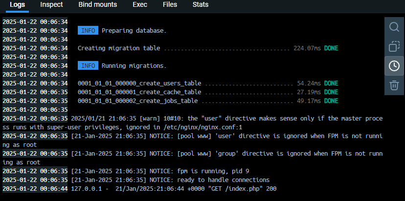
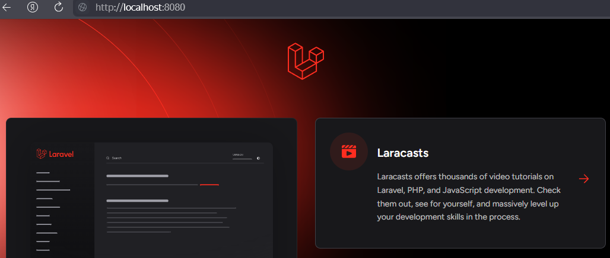
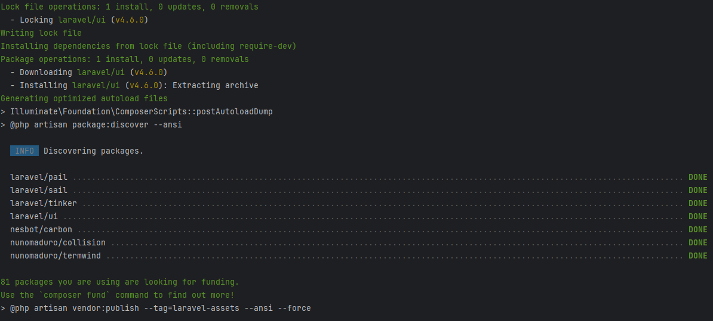
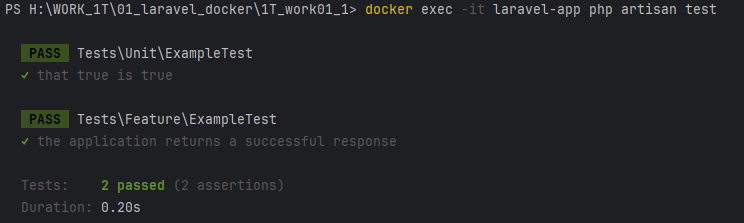

# Создание docker-compose под laravel + PostgreSQL + adminer + Правки

## Добавить исходный код приложения в репозиторий

* Миграция внутри контейнера

## nginx + php должны работать в одном контейнере

## После запуска контейнеров приложение должно быть полностью работоспособным

* Адрес `http://localhost:8080/` отвечает
  
* `composer require laravel/ui` работает
  
* `docker exec -it laravel-app php artisan test`
  
